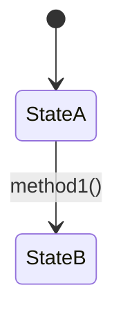

# 本质编程 - 基于三阶方法论的代码设计与分析系统

## 核心思想

> **项目 = 类，模块 = 属性，接口 = 契约，路由 = 方法分发**

软件开发的本质：**属性化的静态结构 + 方法化的动态行为**

- **属性**：静态描述、状态、配置（模块/数据/配置）
- **方法**：动态行为、执行逻辑（对属性的编排和利用）
- **路由**：方法的多场景分发机制（同一场景，不同策略）
- **接口**：跨模块契约（各管各事，通过契约协作）

**关键原则**：所有分析或设计必须从**本质逻辑推导**，杜绝随意性。

---

## 设计原则

### 原则1：单一状态源（Single Source of Truth）

> **状态是信息唯一源，所有节点读写同一个状态对象。**

单一状态源不是只有"全局"一个层级，而是**每个层级都有且仅有一个状态源**，形成层级化的状态治理体系：

```
┌─────────────────────────────────────────────────────────┐
│                    层级化状态治理体系                    │
├─────────────────────────────────────────────────────────┤
│                                                         │
│  项目级（全局状态）                                      │
│  ┌─────────────────────────────────────────────┐       │
│  │  全局状态（Global State）                    │       │
│  │  - 跨模块共享数据                            │       │
│  │  - 所有模块通过契约读写                      │       │
│  └─────────────────────────────────────────────┘       │
│                      ↑↓ 通过接口契约                     │
│  模块级（局部状态）                                      │
│  ┌─────────┐  ┌─────────┐  ┌─────────┐                 │
│  │ 模块A   │  │ 模块B   │  │ 模块C   │                 │
│  │ 内部状态│  │ 内部状态│  │ 内部状态│                 │
│  │ - 自治  │  │ - 自治  │  │ - 自治  │                 │
│  │ - 封装  │  │ - 封装  │  │ - 封装  │                 │
│  └─────────┘  └─────────┘  └─────────┘                 │
│       ↑            ↑            ↑                      │
│       └────────────┴────────────┘                      │
│              对外暴露统一接口                            │
│                                                         │
└─────────────────────────────────────────────────────────┘
```

**核心规则**：
- **项目级**：全局状态是跨模块协作的唯一数据源
- **模块级**：每个模块内部有且只有一个内部状态源，对外通过**统一接口**暴露
- **禁止跨层级直接访问**：模块外部只能通过接口读写模块状态，禁止绕过接口直接操作模块内部数据

**实践要点**：
- 节点只通过**状态源**交换数据，不直接传递参数
- 节点执行完返回**状态更新片段**，由框架合并到状态源
- 路由（边）只根据状态决定**下一个执行哪个节点**
- 模块内部状态由模块自己管理，外部只能通过接口契约访问

---

### 原则2：基础设施四层（通用设计框架）

> **任何项目、任何模块，都必须先明确四层基础设施。这是不分场景的普适性原则。**

| 层面 | 核心问题 | 对应 Skill 概念 | 典型实现 |
|-----|---------|----------------|---------|
| **数据规矩** | 属性是什么类型？有什么约束？ | 属性定义 | Pydantic、Dataclass、TypeScript Interface |
| **数据存储** | 属性值存在哪里？ | 持久化设计 | 数据库、缓存、文件、内存变量 |
| **数据流转** | 属性如何从一个状态变为另一个状态？ | 方法编排 | 验证、转换、事务、异常处理 |
| **接口层** | 模块间如何传递数据？ | 接口定义 | API、函数参数、事件、消息队列 |

**设计顺序**：先定义数据规矩 → 确定存储方式 → 设计流转逻辑 → 暴露接口契约。

**场景A（设计时）**：对每个模块输出四层设计文档（见附录模板）。
**场景B（分析时）**：对每个项目/模块输出四层分析表格（见附录模板）。

---

### 原则3：编码纪律（Code Discipline）

> **从 Andrej Karpathy 的 LLM 编程观察中提炼的四条编码纪律，适用于所有场景。**

| 纪律 | 核心要求 | 检验标准 |
|-----|---------|---------|
| **先思后写** | 不假设、不隐藏困惑、暴露权衡 | 不确定时先问，不静默选择 |
| **简洁优先** | 最少代码解决问题，不做推测性设计 | 资深工程师不会说"过于复杂" |
| **精准修改** | 只碰必须碰的，只清理自己制造的 | 每行改动都能追溯到用户请求 |
| **目标驱动** | 定义成功标准，循环直到验证通过 | 模糊指令转化为可验证目标 |

**与三阶方法论的融合**：
- 场景A：在"是什么"阶段充分思考（先思后写）；从本质推导必要属性（简洁优先）；每个设计决策有验收标准（目标驱动）
- 场景B：看不懂的代码标记困惑点（先思后写）；识别过度设计记录简化点（简洁优先）；分析结论有源码证据（目标驱动）

---

## 两大使用场景

| 场景 | 方向 | 起点 | 终点 | 核心目标 |
|-----|------|------|------|---------|
| **场景A：开发新项目** | 正向设计 | 问题/需求 | 可运行代码 | 从零构建系统 |
| **场景B：解析现有项目** | 逆向分析 | 现有代码 | 理解文档 | 理解已有系统 |

### 场景对比

```
场景A：正向设计                    场景B：逆向分析
是什么 → 为什么 → 怎么做          怎么做 ← 为什么 ← 是什么
(定义)   (决策)   (实现)          (观察)   (推导)   (推导)
   ↑                              ↓
问题/需求                      现有代码
```

### 核心差异

| 维度 | 场景A | 场景B |
|-----|-------|-------|
| **思维方向** | 正向推导：从需求到实现 | 逆向推导：从代码到本质 |
| **属性来源** | 从本质特征推导属性 | 从代码结构识别属性 |
| **输出目标** | 生成可运行代码 | 生成理解文档 |
| **文档位置** | 项目代码库内 | Obsidian Vault |

**不确定选哪个场景？** 参考[附录B：快速参考](#附录b快速参考)中的场景选择决策树。

---

## 场景A：开发新项目（正向设计）

### 执行流程

```
第1步：是什么 (What) - 定义本质
    ├── 1.1 本质特征 → 从问题推导系统根本
    ├── 1.2 关键属性 → 从本质推导具体组成
    ├── 1.3 区分属性 → 明确不是什么
    └── 1.4 设计哲学 → 指导思想
           ↓
第2步：为什么 (Why) - 确定架构
    ├── 2.1 存在理由 → 从本质推导为什么需要
    ├── 2.2 技术选型 → 从本质推导技术决策
    └── 2.3 架构设计 → 从本质推导系统结构
           ↓
第3步：怎么做 (How) - 实现交付
    ├── 3.1 模块划分 → 从属性推导模块边界
    ├── 3.2 方法设计 → 从属性推导方法逻辑
    ├── 3.3 路由设计 → 方法的多场景分发
    └── 3.4 接口定义 → 从协作推导接口契约
           ↓
    输出：可运行的代码实现 + 设计文档
```

### 输出文档结构

场景A的文档保存在**项目代码库内**，作为项目文档：

```
{project-root}/
├── docs/
│   ├── 01-本质分析.md          # 是什么：问题定义、本质特征、关键属性
│   ├── 02-架构决策.md          # 为什么：技术选型、架构设计理由
│   ├── 03-模块设计.md          # 怎么做：模块划分、接口契约
│   └── 04-四层设计/            # 每个模块的四层基础设施设计
│       ├── {模块A}-四层设计.md
│       ├── {模块B}-四层设计.md
│       └── ...
├── src/                        # 可运行代码
└── README.md                   # 项目入口说明
```

### 文档命名规范

| 文档类型 | 命名格式 | 内容 |
|---------|---------|------|
 | **本质分析** | `01-本质分析.md` | 是什么阶段输出：问题定义、本质特征、关键属性 |
| **架构决策** | `02-架构决策.md` | 为什么阶段输出：技术选型、架构设计理由 |
| **模块设计** | `03-模块设计.md` | 怎么做阶段输出：模块划分、接口契约 |
| **四层设计** | `{模块名}-四层设计.md` | 每个模块的四层基础设施详细设计 |

### 检查清单

- [ ] 已从问题推导出系统本质特征
- [ ] 已从本质推导出关键属性，并标记 ✅需深入 的模块
- [ ] 已明确系统边界（不做什么）
- [ ] 已推导技术选型理由
- [ ] 已完成模块划分
- [ ] 每个模块已完成四层设计（数据规矩、数据存储、数据流转、接口层）
- [ ] 已定义模块对外接口契约
- [ ] 已设计状态流转路由
- [ ] 已生成设计文档（docs/目录）
- [ ] 已实现可运行代码（src/目录）

---

## 场景B：解析现有项目（逆向分析）

### 执行流程

```
第1步：怎么做 (How) - 观察实现
    ├── 1.1 获取项目信息 → GitHub元数据、README
    ├── 1.2 浏览源码结构 → 目录组织、文件分布
    ├── 1.3 识别模块划分 → 从代码结构识别属性
    │                    └── 标记 ✅需深入 的模块
    └── 1.4 分析方法实现 → 方法如何利用属性
        **遇到看不懂的代码时**：参考[附录C：代码阅读辅助指南](#附录c代码阅读辅助指南)
           ↓
第2步：为什么 (Why) - 推导设计
    ├── 2.1 技术选型分析 → 从源码推导决策原因
    ├── 2.2 架构设计推导 → 从结构推导设计思想
    └── 2.3 设计亮点识别 → 可借鉴的模式
           ↓
第3步：是什么 (What) - 推导本质
    ├── 3.1 本质特征推导 → 从代码推导系统根本
    ├── 3.2 关键属性确认 → 验证识别的属性
    └── 3.3 区分属性界定 → 明确系统边界
           ↓
    输出：项目理解文档（00-{repo}-三阶解构.md 保存到Obsidian）
           ↓
第4步：递归深入 - 分析标记模块（自动执行）
    **触发条件**：项目级文档中存在 ✅需深入 标记的模块
    
    对每个 ✅需深入 的模块，按序号顺序执行：
    ├── 4.1 读取该模块的源码文件
    ├── 4.2 执行逆向三阶分析（怎么做→为什么→是什么）
    ├── 4.3 输出四层基础设施分析
    ├── 4.4 生成模块级文档（01-{模块A}-三阶解构.md）
    ├── 4.5 检查该模块是否还有 ✅需深入 的子模块
    │   └── 如有，递归执行第4步（序号递增：02-, 03-...）
    └── 4.6 当前模块所有 ✅ 分析完毕，返回上一级
           ↓
    所有模块递归分析完毕
           ↓
    最终输出：完整的项目文档集合
```

### 检查清单

**项目级分析**
- [ ] 已获取GitHub项目元数据
- [ ] 已浏览项目目录结构
- [ ] 已识别核心模块和入口文件
- [ ] 已执行逆向三阶分析
- [ ] 已生成项目级文档（00-{repo}-三阶解构.md）
- [ ] 已标记需深入分析的模块（✅）
- [ ] 已完成基础设施四层分析

**模块级分析（递归）**
- [ ] 对每个 ✅需深入 的模块执行深入分析
- [ ] 已生成模块级文档
- [ ] 模块文档包含四层分析
- [ ] 没有更多 ✅需深入 的模块时停止

**汇总输出**
- [ ] 已生成架构图谱（99-架构图谱.md）
- [ ] 已更新项目索引（00-GitHub项目索引.md）

### 输出文档结构

```
C:\Users\LX\Documents\Obsidian Vault\github/
├── {org}-{repo}/
│   ├── 00-{repo}-三阶解构.md      # 项目级分析
│   ├── 01-{模块A}-三阶解构.md     # 模块级分析
│   ├── 02-{模块B}-三阶解构.md     # 模块级分析
│   └── 99-架构图谱.md             # 架构汇总
└── 00-GitHub项目索引.md            # 所有项目索引
```

### 文档命名规范

| 文档类型 | 命名格式 | 示例 |
|---------|---------|------|
| **项目级分析** | `00-{repo}-三阶解构.md` | `00-react-三阶解构.md` |
| **模块级分析** | `{序号}-{模块名}-三阶解构.md` | `01-core-三阶解构.md` |
| **架构图谱** | `99-架构图谱.md` | `99-架构图谱.md` |
| **项目索引** | `00-GitHub项目索引.md` | `00-GitHub项目索引.md` |

---

## 完整示例：任务管理系统（场景A）

以下展示正向推导过程，重点体现**层级化状态治理**和**四层基础设施**。

---

### 第1步：是什么 (What) - 定义本质

**核心问题**：这个系统本质上是什么？

#### 1.1 本质特征（内涵）

| 推导要素 | 逻辑分析 | 结论 |
|---------|---------|------|
| **核心问题** | 用户面临什么问题？ | 任务太多，容易遗漏；任务分散，难以追踪 |
| **目标用户** | 为谁解决？ | 个人用户、小型团队 |
| **核心价值** | 解决后带来什么？ | 提高效率、减少遗漏、清晰进度 |
| **一句话定义** | 类比理解 | "这是一个任务管家，帮你记住该做的事并跟踪进度" |

**本质特征**：
1. **记忆辅助** - 系统必须记住用户创建的所有任务
2. **状态追踪** - 系统必须能追踪任务从创建到完成的全生命周期
3. **分类组织** - 系统必须支持按不同维度组织任务
4. **提醒通知** - 系统必须在关键时刻提醒用户

#### 1.2 关键属性（外延）

```
本质特征 "记忆辅助"  → 属性：任务模块（Task）✅ 需深入
本质特征 "状态追踪"  → 属性：用户模块（User）、历史模块（History）
本质特征 "分类组织"  → 属性：标签模块（Tag）、项目模块（Project）
本质特征 "提醒通知"  → 属性：调度模块（Scheduler）、通知模块（Notification）
```

| 属性名 | 推导来源 | 是否需深入 |
|-------|---------|----------|
| **任务模块** | 记忆辅助的核心 | ✅ 需深入 |
| **用户模块** | 状态追踪需要身份 | ❌ |
| **标签模块** | 分类组织需要 | ❌ |
| **项目模块** | 分类组织需要 | ❌ |
| **历史模块** | 状态追踪需要审计 | ❌ |
| **调度模块** | 提醒通知需要触发 | ❌ |
| **通知模块** | 提醒通知需要渠道 | ❌ |

#### 1.3 区分属性（边界）

- ✅ 做：个人任务管理、简单分配、状态追踪、提醒通知
- ❌ 不做：复杂日历视图、甘特图、审批工作流、资源管理

#### 1.4 设计哲学

**简单优先，快速记录，清晰追踪**

---

### 第2步：为什么 (Why) - 确定架构

#### 2.1 存在理由

```
因：用户大脑记忆有限，任务散落在各处，不知道优先做什么
果：提供统一入口记录任务，支持多维度分类，清晰展示状态
```

#### 2.2 技术栈决策

| 决策项 | 选择 | 推导逻辑 |
|-------|------|---------|
| **架构** | 单体应用 | 个人工具，非高并发 |
| **语言** | Python | 开发效率高，适合快速迭代 |
| **Web框架** | FastAPI | 异步支持好，类型安全 |
| **数据库** | PostgreSQL | 关系型数据适合任务关联 |

---

### 第3步：怎么做 (How) - 实现交付

#### 3.1 全局状态设计（项目级单一状态源）

```python
from typing import TypedDict, Optional, List
from datetime import datetime

class AppState(TypedDict):
    """项目级全局状态 - 所有模块共享"""
    current_user_id: Optional[str]
    current_task_id: Optional[str]
    messages: List[dict]          # 系统消息/通知
    errors: List[dict]            # 错误记录
```

**规则**：所有模块通过接口契约读写全局状态，禁止直接操作其他模块内部数据。

#### 3.2 模块划分与接口契约

```
项目（任务管理系统）
├── 用户模块（User）
│   ├── 内部状态：user_id, username, email, settings
│   └── 对外接口：register(), login(), get_settings()
│
├── 任务模块（Task）✅ 需深入
│   ├── 内部状态：task_id, title, description, status, priority, due_date
│   └── 对外接口：create(), get(), list(), transition_status()
│
├── 标签模块（Tag）
│   ├── 内部状态：tag_id, name, color
│   └── 对外接口：create(), link_to_task(), list_by_task()
│
└── ...其他模块
```

#### 3.3 任务模块四层设计（✅ 需深入模块示例）

**模块内部状态（局部单一状态源）**：

```python
from enum import Enum
from dataclasses import dataclass
from datetime import datetime
from typing import Optional, List

class TaskStatus(str, Enum):
    TODO = "todo"
    IN_PROGRESS = "in_progress"
    PAUSED = "paused"
    COMPLETED = "completed"
    CANCELLED = "cancelled"

@dataclass
class TaskState:
    """任务模块内部状态 - 模块级单一状态源"""
    task_id: str
    user_id: str
    title: str
    description: str = ""
    status: TaskStatus = TaskStatus.TODO
    priority: str = "medium"  # low/medium/high
    due_date: Optional[datetime] = None
    project_id: Optional[str] = None
    tag_ids: List[str] = None
    created_at: datetime = None
    updated_at: datetime = None
    started_at: Optional[datetime] = None
    completed_at: Optional[datetime] = None
    pause_reason: Optional[str] = None
    cancel_reason: Optional[str] = None
```

**四层设计**：

| 层面 | 设计内容 |
|-----|---------|
| **数据规矩** | `TaskState` Dataclass，字段类型/约束/默认值已定义；`TaskStatus` 枚举限制状态值 |
| **数据存储** | PostgreSQL `tasks` 表；异步写入；配合 History 表实现审计 |
| **数据流转** | 状态机：`todo → in_progress → completed`；流转前验证权限；失败回滚 |
| **接口层** | `TaskService` Protocol（见下方）；输入/输出/错误契约已定义 |

**模块对外接口契约**：

```python
from typing import Protocol, List, Optional
from dataclasses import dataclass

@dataclass
class TaskCreateRequest:
    title: str
    description: str = ""
    priority: str = "medium"
    due_date: Optional[datetime] = None
    tag_ids: List[str] = None
    project_id: Optional[str] = None

@dataclass
class TaskResponse:
    task_id: str
    title: str
    status: str
    priority: str
    due_date: Optional[datetime]

class TaskService(Protocol):
    """任务模块对外接口 - 外部只能通过此接口访问任务数据"""
    
    def create_task(self, user_id: str, request: TaskCreateRequest) -> TaskResponse: ...
    def get_task(self, task_id: str) -> Optional[TaskResponse]: ...
    def list_tasks(self, user_id: str, status: Optional[str] = None) -> List[TaskResponse]: ...
    def transition_status(self, task_id: str, action: str, **kwargs) -> TaskResponse: ...
```

**关键规则**：
- 外部模块（如 Notification、History）只能通过 `TaskService` 接口访问任务数据
- 禁止直接操作 `TaskState` 内部字段
- 模块内部状态变更由模块自己管理，外部无感知

#### 3.4 路由设计（状态驱动的多场景分发）

```python
class TaskStatusRouter:
    """任务状态路由 - 同一场景（状态变更），不同策略"""
    
    def transition(self, action: str, task_id: str, **kwargs) -> TaskResponse:
        handlers = {
            "start": self._start_task,
            "complete": self._complete_task,
            "pause": self._pause_task,
            "resume": self._resume_task,
            "cancel": self._cancel_task,
        }
        handler = handlers.get(action)
        if not handler:
            raise ValueError(f"Unknown action: {action}")
        return handler(task_id, **kwargs)
    
    def _start_task(self, task_id: str, **kwargs):
        task = TaskService.get_task(task_id)
        # 通过接口访问，不直接操作内部状态
        return TaskService.transition_status(task_id, "start")
    
    def _complete_task(self, task_id: str, **kwargs):
        task = TaskService.transition_status(task_id, "complete")
        # 副作用：发送通知（通过接口）
        Notification.send(task.user_id, f"任务完成: {task.title}")
        return task
    
    # ...其他策略
```

**路由本质**：条件判断决定执行顺序。节点（方法）只读写状态，边（路由）只决定下一个节点。

#### 3.5 统一接口层

```python
def task_api_endpoint(request: Request) -> Response:
    """任务API统一入口：参数收敛 → 路由分发 → 结果组装"""
    action = request.headers.get("X-Action", "create")
    user_id = request.user.id
    
    if action == "create":
        result = TaskService.create_task(user_id, TaskCreateRequest(**request.json))
    elif action == "get":
        result = TaskService.get_task(request.json["task_id"])
    elif action in ["start", "complete", "pause", "resume", "cancel"]:
        result = TaskService.transition_status(request.json["task_id"], action)
    else:
        raise ValueError(f"Unknown action: {action}")
    
    return Response(code=0, message="success", data=result)
```

---

## 递归执行

当属性标记为"✅ 需深入"时，对该属性递归执行三阶分析：

```
项目（任务管理系统）
├── 用户模块 ❌ → 当前文档说明
├── 任务模块 ✅ → 深入分析
│       └── 00-任务模块-三阶解构.md
│           ├── 是什么：任务模块本质是什么？
│           ├── 为什么：为什么这样设计？
│           └── 怎么做：如何实现？（含四层设计）
└── ...
```

| 标记 | 条件 | 后续动作 |
|-----|------|---------|
| **✅ 需深入** | 复杂度高/独立性强/复用性高 | 生成子文档，递归执行三阶分析 |
| **❌ 当前文档说明** | 简单属性 | 当前文档详细展开 |

**停止条件**：
1. 当前层级没有"✅ 需深入"的属性
2. 属性已经是基础类型（字符串、数字、布尔值）
3. 模块职责清晰且简单

---

## 核心公式

```
┌─────────────────────────────────────────────────────────┐
│                      本质编程公式                        │
├─────────────────────────────────────────────────────────┤
│                                                         │
│   三阶推导：                                            │
│   场景A：是什么 → 为什么 → 怎么做                        │
│   场景B：怎么做 ← 为什么 ← 是什么                        │
│                                                         │
│   开发模式：                                            │
│   项目开发 = 属性化静态开发 + 方法化动态开发             │
│                                                         │
│   方法扩展：                                            │
│   多场景 = 同核心方法的路由分支                          │
│                                                         │
│   接口本质：                                            │
│   接口 = 跨模块协作契约                                  │
│                                                         │
│   状态治理：                                            │
│   单一状态源 = 项目级全局状态 + 模块级内部状态           │
│                ↓ 通过接口契约隔离                        │
│   禁止跨层级直接访问                                    │
│                                                         │
│   基础设施：                                            │
│   四层框架 = 数据规矩 → 数据存储 → 数据流转 → 接口层     │
│   （不分场景，项目级和模块级都必须回答）                 │
│                                                         │
│   编码纪律：                                            │
│   先思后写 + 简洁优先 + 精准修改 + 目标驱动              │
│                                                         │
└─────────────────────────────────────────────────────────┘
```

---

## 附录

### 附录A：场景B文档模板

#### 项目级分析模板（00-{repo}-三阶解构.md）

```markdown
#### {repo} - 三阶解构

> GitHub: {github_url} | 分析日期：{date}

##### 元数据
- **语言**：{primary_language} | **Star数**：{stars}

##### 一、怎么做 (How) - 观察实现

###### 1.1 模块划分
| 模块名 | 源码位置 | 职责 | 标记 |
|-------|---------|------|------|
| **core** | `src/core/` | 核心逻辑 | ✅ 需深入 → [[01-core-三阶解构]] |
| **utils** | `src/utils/` | 工具函数 | ❌ 当前文档说明 |

###### 1.2 核心方法分析
**方法：{方法名}**
- 位置：`{文件路径}:{行号}`
- 利用的属性：...

##### 二、为什么 (Why) - 推导设计

###### 2.1 技术栈决策
| 决策项 | 选择 | 源码证据 | 推导逻辑 |
|-------|------|---------|---------|
| **语言** | {lang} | `package.json` | ... |

###### 2.2 设计亮点
1. **...**：{说明}（证据：{文件路径}）

##### 三、是什么 (What) - 推导本质

###### 3.1 本质特征
| 推导要素 | 源码证据 | 结论 |
|---------|---------|------|
| **核心问题** | 从README分析 | ... |

##### 四、基础设施四层分析

###### 1. 数据规矩
| 文件路径 | 类型定义 | 核心字段 | 约束规则 |
|---------|---------|---------|---------|
| {path} | {Class} | {fields} | {constraints} |

###### 2. 数据存储
| 数据类型 | 存储介质 | 存储策略 | 持久化机制 |
|---------|---------|---------|-----------|
| {type} | {DB/Cache} | {sync/async} | {backup} |

###### 3. 数据流转


| 流转路径 | 触发方法 | 验证规则 | 异常处理 |
|---------|---------|---------|---------|
| A → B | {method} | {validation} | {rollback} |

###### 4. 接口层
| 接口名 | 输入类型 | 输出类型 | 调用方式 |
|-------|---------|---------|---------|
| {name} | {input} | {output} | {sync/async} |

##### 参考链接
- [[99-架构图谱]] | [[00-GitHub项目索引]]
```

#### 模块级分析模板（{序号}-{模块名}-三阶解构.md）

```markdown
#### {模块名} - 三阶解构

> 所属项目：{repo} | 源码位置：{source_path}

##### 模块概览
- **职责**：{一句话描述}

##### 一、怎么做 (How) - 观察实现

###### 1.1 子模块划分
| 组件名 | 源码文件 | 职责 | 标记 |
|-------|---------|------|------|
| **ComponentA** | `file1.js` | 功能A | ✅ 需深入 |

###### 1.2 核心方法分析
**方法：{方法名}**
- **位置**：`{文件路径}:{行号}`
- **设计模式**：{模式}
- **代码语义**：
  ```python
  # 第1行：...（解释）
  ```
- **数据流**：`输入 → 验证 → 处理 → 输出`

##### 二、为什么 (Why) - 推导设计

###### 2.1 与项目其他模块的关系
```
{模块名}
    ├── 依赖 → [[00-{repo}-三阶解构]] 中的 {其他模块}
    └── 被依赖 ← {其他模块}
```

##### 三、是什么 (What) - 推导本质

###### 3.1 模块本质
- **核心问题**：这个模块解决什么问题？
- **设计思想**：作者的设计意图是什么？

##### 四、基础设施四层分析
（同项目级模板结构）

##### 参考链接
- [[00-{repo}-三阶解构]] | [[99-架构图谱]]
```

### 项目索引模板（00-GitHub项目索引.md）

```markdown
### GitHub项目索引

| 序号 | 项目名称 | 组织 | 语言 | Star数 | 分析文档 |
|-----|---------|------|------|--------|---------|
| 1 | react | facebook | JavaScript | 200k+ | [[00-react-三阶解构]] |

#### 分类索引
##### 前端框架
- [[00-react-三阶解构]]
```

---

### 附录B：快速参考

#### 场景选择决策树

```
有现成代码？
    ├── 是 → 场景B：解析项目
    │         ├── 第1步：观察实现（怎么做）→ 标记 ✅需深入
    │         ├── 第2步：推导设计（为什么）
    │         ├── 第3步：推导本质（是什么）→ 生成 00-{repo}-三阶解构.md
    │         └── 第4步：递归深入 → 生成模块级文档 → 99-架构图谱.md
    └── 否 → 场景A：开发新项目
              └── 正向三阶设计：是什么→为什么→怎么做
```

#### 关键问题清单

**场景A：开发新项目**
- 这个系统本质上要解决什么问题？
- 从本质能推导出哪些关键属性？
- 模块如何划分？哪些需深入（✅）？
- 每个模块的四层基础设施如何设计？
- 模块对外接口契约是什么？
- 全局状态和模块内部状态如何定义？

**场景B：解析项目**
- 从代码能看出哪些模块？
- 哪些模块需要深入分析（✅）？
- 每个方法利用了哪些属性？
- 基础设施四层分别是什么？
- 模块对外暴露的接口是什么？
- 是否还有需深入分析的子模块？

---

### 附录C：代码阅读辅助指南

#### 三层认知模型

```
第一层：语法层面（是什么）
    └── 认识关键字、语法结构 ✅ 大多数人已掌握

第二层：语义层面（做什么）
    └── 理解业务逻辑、识别设计模式 ❌ 需要补充

第三层：意图层面（为什么）
    └── 理解设计意图、技术选型原因 ❌ 需要补充
```

**突破关键**：建立模式识别能力。

#### 常见设计模式速查

| 模式 | 代码特征 | 常见场景 |
|-----|---------|---------|
| **工厂模式** | `XxxFactory.create()` | 统一创建对象 |
| **单例模式** | `getInstance()` | 全局唯一实例 |
| **观察者模式** | `on/emit/subscribe` | 事件订阅发布 |
| **策略模式** | `strategy.execute()` | 多态替换算法 |
| **装饰器模式** | `@decorator` | 动态添加功能 |
| **建造者模式** | `builder.setXxx().build()` | 链式构建对象 |
| **适配器模式** | `Adapter.wrap()` | 接口转换兼容 |
| **代理模式** | `Proxy.method()` | 访问控制、延迟加载 |

#### 分层阅读法

1. **先读"形状"**：看方法名和类结构，识别 CRUD、路由、工厂等模式
2. **找"钩子"和"委托"**：区分核心逻辑（创建/处理）和辅助逻辑（验证/通知/日志）
3. **追踪数据流**：`输入 → 验证 → 转换 → 存储 → 通知 → 返回`

#### 常见代码阅读障碍速查表

| 障碍 | 原因 | 解决方案 |
|-----|------|---------|
| 看不懂链式调用 | 不熟悉流式API或建造者模式 | 识别 `.build()`、`.execute()` 等终点方法 |
| 看不懂装饰器 | 不理解AOP或元编程 | 先学装饰器模式，再看具体实现 |
| 看不懂回调 | 不熟悉异步编程 | 追踪回调的注册点和触发点 |
| 看不懂泛型 | 类型系统不熟悉 | 先忽略类型参数，理解核心逻辑 |
| 看不懂反射 | 元编程知识不足 | 搜索反射的具体用途（序列化、ORM） |
| 看不懂DSL | 领域特定语言 | 查找该DSL的语法文档 |
