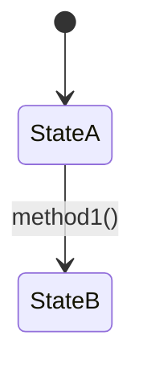

# 本质探索 - 基于三阶方法论的认知与设计系统

> **核心原则**：坡度理解 —— 先点出概念 → 建立联系 → 再详细解释
> 
> **设计思想**：项目 = 类，模块 = 属性，接口 = 契约，路由 = 方法分发

---

## 坡度理解三阶段（贯穿所有分析）

### 坡度理解与三阶方法论的关系

> **重要说明**：坡度理解不是与三阶方法论平行的"第四阶"，而是**每一阶内部的认知深化方法**。

| 维度 | 三阶方法论 | 坡度理解 |
|-----|-----------|---------|
| **性质** | 逻辑推导方法 | 认知呈现方法 |
| **解决的问题** | 思考什么（内容） | 如何呈现（形式） |
| **关系** | 横向逻辑链 | 纵向深化链 |
| **推导类型** | 因果推导（是什么→为什么→怎么做） | 认知深化（整体→结构→细节） |

**两者的正交组合**：
- 三阶决定**"思考什么"**：是什么 → 为什么 → 怎么做
- 坡度决定**"如何呈现"**：点出概念 → 建立联系 → 详细解释

```
┌─────────────────────────────────────────────────────────────┐
│                    正交组合矩阵                              │
├─────────────────────────────────────────────────────────────┤
│                                                             │
│   三阶方法论（横向：逻辑推导）                                │
│   ┌──────────┬──────────┬──────────┐                       │
│   │  是什么   │  为什么   │  怎么做   │                       │
│   └────┬─────┴────┬─────┴────┬─────┘                       │
│        │          │          │                             │
│   坡度 │    坡度   │    坡度   │    坡度                     │
│   理解 │    理解   │    理解   │    理解                     │
│   （纵 │   （纵    │   （纵    │   （纵                      │
│   向） │   向）    │   向）    │   向）                      │
│        ↓          ↓          ↓                             │
│   ┌──────────┬──────────┬──────────┐                       │
│   │阶段1→2→3│阶段1→2→3│阶段1→2→3│                       │
│   └──────────┴──────────┴──────────┘                       │
│                                                             │
│   坡度理解（纵向：认知深化）                                  │
│   阶段1：点出概念 → 阶段2：建立联系 → 阶段3：详细解释         │
│                                                             │
└─────────────────────────────────────────────────────────────┘
```

### 坡度理解三阶段

在任何场景、任何阶段的分析中，都必须遵循坡度理解的渐进式认知方法：

```
┌─────────────────────────────────────────────────────────┐
│                     坡度理解三阶段                       │
├─────────────────────────────────────────────────────────┤
│                                                         │
│  阶段1：点出概念（30秒抓住核心）                          │
│  ├── 一句话定义（类比理解）                              │
│  └── 本质特征表格（3-5个核心推导要素）                    │
│                      ↓                                  │
│  阶段2：建立联系（2分钟理解框架）                         │
│  ├── 关键属性表格（标记✅❌）                            │
│  └── 属性关系图（Mermaid）                              │
│                      ↓                                  │
│  阶段3：详细解释（按需深入）                              │
│  ├── 详细属性讲解（定义+关键点）                         │
│  └── 方法实现细节（代码/步骤）                          │
│                                                         │
└─────────────────────────────────────────────────────────┘
```

**坡度理解的应用原则**：
- **阶段1**：让读者快速抓住核心（30秒理解）
- **阶段2**：建立概念间的联系（2分钟理解框架）
- **阶段3**：深入细节（按需阅读）

**为什么这样设计？**
- 符合人类认知规律：先整体后局部（格式塔心理学）、先框架后细节（认知负荷理论）
- 降低认知门槛：读者可以先快速了解全貌，再决定是否需要深入
- 避免信息过载：阶段3的内容是"按需阅读"，不是必须阅读的

---

## 核心思想

> **项目 = 类，模块 = 属性，接口 = 契约，路由 = 方法分发**

软件开发的本质：**属性化的静态结构 + 方法化的动态行为**

- **属性**：静态描述、状态、配置（模块/数据/配置）
- **方法**：动态行为、执行逻辑（对属性的编排和利用）
- **路由**：方法的多场景分发机制（同一场景，不同策略）
- **接口**：跨模块契约（各管各事，通过契约协作）

**关键原则**：所有分析或设计必须从**本质逻辑推导**，杜绝随意性。

---

## 设计原则

### 原则1：单一状态源（Single Source of Truth）

> **状态是信息唯一源，所有节点读写同一个状态对象。**

单一状态源不是只有"全局"一个层级，而是**每个层级都有且仅有一个状态源**，形成层级化的状态治理体系：

```
┌─────────────────────────────────────────────────────────┐
│                    层级化状态治理体系                    │
├─────────────────────────────────────────────────────────┤
│                                                         │
│  项目级（全局状态）                                      │
│  ┌─────────────────────────────────────────────┐       │
│  │  全局状态（Global State）                    │       │
│  │  - 跨模块共享数据                            │       │
│  │  - 所有模块通过契约读写                      │       │
│  └─────────────────────────────────────────────┘       │
│                      ↑↓ 通过接口契约                     │
│  模块级（局部状态）                                      │
│  ┌─────────┐  ┌─────────┐  ┌─────────┐                 │
│  │ 模块A   │  │ 模块B   │  │ 模块C   │                 │
│  │ 内部状态│  │ 内部状态│  │ 内部状态│                 │
│  │ - 自治  │  │ - 自治  │  │ - 自治  │                 │
│  │ - 封装  │  │ - 封装  │  │ - 封装  │                 │
│  └─────────┘  └─────────┘  └─────────┘                 │
│       ↑            ↑            ↑                      │
│       └────────────┴────────────┘                      │
│              对外暴露统一接口                            │
│                                                         │
└─────────────────────────────────────────────────────────┘
```

**核心规则**：
- **项目级**：全局状态是跨模块协作的唯一数据源
- **模块级**：每个模块内部有且只有一个内部状态源，对外通过**统一接口**暴露
- **禁止跨层级直接访问**：模块外部只能通过接口读写模块状态，禁止绕过接口直接操作模块内部数据

**实践要点**：
- 节点只通过**状态源**交换数据，不直接传递参数
- 节点执行完返回**状态更新片段**，由框架合并到状态源
- 路由（边）只根据状态决定**下一个执行哪个节点**
- 模块内部状态由模块自己管理，外部只能通过接口契约访问

---

### 原则2：基础设施四层（通用设计框架）

> **任何项目、任何模块，都必须先明确四层基础设施。这是不分场景的普适性原则。**

| 层面 | 核心问题 | 对应 Skill 概念 | 典型实现 |
|-----|---------|----------------|---------|
| **数据规矩** | 属性是什么类型？有什么约束？ | 属性定义 | Pydantic、Dataclass、TypeScript Interface |
| **数据存储** | 属性值存在哪里？ | 持久化设计 | 数据库、缓存、文件、内存变量 |
| **数据流转** | 属性如何从一个状态变为另一个状态？ | 方法编排 | 验证、转换、事务、异常处理 |
| **接口层** | 模块间如何传递数据？ | 接口定义 | API、函数参数、事件、消息队列 |

**设计顺序**：先定义数据规矩 → 确定存储方式 → 设计流转逻辑 → 暴露接口契约。

**场景A（设计时）**：对每个模块输出四层设计文档（见附录模板）。
**场景B（分析时）**：对每个项目/模块输出四层分析表格（见附录模板）。

---

### 原则3：编码纪律（Code Discipline）

> **从 Andrej Karpathy 的 LLM 编程观察中提炼的四条编码纪律，适用于所有场景。**

| 纪律 | 核心要求 | 检验标准 |
|-----|---------|---------|
| **先思后写** | 不假设、不隐藏困惑、暴露权衡 | 不确定时先问，不静默选择 |
| **简洁优先** | 最少代码解决问题，不做推测性设计 | 资深工程师不会说"过于复杂" |
| **精准修改** | 只碰必须碰的，只清理自己制造的 | 每行改动都能追溯到用户请求 |
| **目标驱动** | 定义成功标准，循环直到验证通过 | 模糊指令转化为可验证目标 |

**与三阶方法论的融合**：
- 场景A：在"是什么"阶段充分思考（先思后写）；从本质推导必要属性（简洁优先）；每个设计决策有验收标准（目标驱动）
- 场景B：看不懂的代码标记困惑点（先思后写）；识别过度设计记录简化点（简洁优先）；分析结论有源码证据（目标驱动）

---

## 三大使用场景

| 场景 | 方向 | 起点 | 终点 | 核心目标 | 输出位置 |
|-----|------|------|------|---------|---------|
| **场景A：通用知识探索** | 正向推导 | 概念/问题 | 结构化知识 | 从零构建知识体系 | Obsidian/通用笔记 |
| **场景B：开发新项目** | 正向设计 | 问题/需求 | 可运行代码 | 从零构建系统 | 项目代码库内 |
| **场景C：解析现有项目** | 逆向分析 | 现有代码 | 理解文档 | 理解已有系统 | Obsidian Vault |

### 场景对比

```
场景A：通用知识探索              场景B：开发新项目              场景C：解析现有项目
是什么 → 为什么 → 怎么做        是什么 → 为什么 → 怎么做      怎么做 ← 为什么 ← 是什么
   ↑                              ↑                              ↓
概念/问题                      问题/需求                      现有代码
```

### 核心差异

| 维度 | 场景A | 场景B | 场景C |
|-----|-------|-------|-------|
| **思维方向** | 正向推导 | 正向推导 | 逆向推导 |
| **属性来源** | 从本质特征推导属性 | 从本质特征推导属性 | 从代码结构识别属性 |
| **输出目标** | 生成结构化知识笔记 | 生成可运行代码 | 生成理解文档 |
| **文档位置** | Obsidian/通用笔记 | 项目代码库内 | Obsidian Vault |
| **坡度应用** | 是什么/为什么/怎么做各用坡度三阶段 | 是什么/为什么/怎么做各用坡度三阶段 | 怎么做/为什么/是什么各用坡度三阶段 |

**不确定选哪个场景？** 参考[附录B：快速参考](#附录b快速参考)中的场景选择决策树。

---

## 场景A：通用知识探索（正向推导）

### 执行流程（坡度化）

```
第1步：是什么（坡度阶段1→2→3）
    ├── 阶段1：点出概念
    │   ├── 一句话定义（类比理解）
    │   └── 本质特征表格（3-5个核心推导要素）
    ├── 阶段2：建立联系
    │   ├── 关键属性表格（标记✅❌）
    │   └── 属性关系图
    └── 阶段3：详细解释
        └── 对❌属性详细讲解（定义+关键点）
           ↓
第2步：为什么（坡度阶段1→2→3）
    ├── 阶段1：点出概念
    │   └── 因果链一句话总结
    ├── 阶段2：建立联系
    │   └── 因果链表格（因→果→逻辑→类比）
    └── 阶段3：详细解释
        └── 依据支撑 + 质疑验证
           ↓
第3步：怎么做（坡度阶段1→2→3）
    ├── 阶段1：点出概念
    │   └── 流程一句话概述
    ├── 阶段2：建立联系
    │   └── 执行步骤表格
    └── 阶段3：详细解释
        └── 每个步骤详细说明 + 资源需求 + 验证方法
           ↓
第4步：递归深入（自动执行）
    └── 对每个✅属性，递归执行第1-3步
```

### 输出文档结构

场景A的文档保存在**Obsidian Vault/通用笔记**下：

```
C:/Users/LX/Documents/Obsidian Vault/
└── 通用笔记/{分类}/
    ├── {概念名}-三阶解构.md              # 主文档（是什么→为什么→怎么做）
    ├── 01-{子概念A}-三阶解构.md          # 第1层递归深入
    ├── 02-{子概念B}-三阶解构.md          # 第1层递归深入
    │   ├── 02-01-{子概念B1}-三阶解构.md  # 第2层递归深入
    │   └── 02-02-{子概念B2}-三阶解构.md  # 第2层递归深入
    └── 99-知识图谱.md                    # 知识关系汇总
```

**编号规则**：
- 主文档：无编号（或根据分类前缀）
- 第1层子概念：`01-`, `02-`, `03-`...（两位数）
- 第2层子概念：`01-01-`, `01-02-`...（四位数，体现父子关系）
- 第3层子概念：`01-01-01-`...（六位数）
- 汇总文档：`99-`

### 文档命名规范

| 文档类型 | 命名格式 | 内容 |
|---------|---------|------|
| **知识笔记** | `{概念名}-三阶解构.md` | 是什么阶段输出：概念定义、本质特征、关键属性 |
| **递归深入** | `{序号}-{子概念}-三阶解构.md` | 对✅标记的子概念深入分析 |
| **知识图谱** | `99-知识图谱.md` | 所有概念的关系图谱 |

### 检查清单

- [ ] 阶段1：已给出概念的一句话定义和本质特征
- [ ] 阶段2：已列出关键属性表格并标记✅❌
- [ ] 阶段3：已对❌属性展开详细讲解
- [ ] 是什么：已从问题/概念推导出本质特征
- [ ] 为什么：已构建因果逻辑链（因→果→逻辑→类比）
- [ ] 怎么做：已设计执行步骤和验证方法
- [ ] 递归：已对所有✅属性生成子文档
- [ ] 汇总：已生成知识图谱

---

## 场景B：开发新项目（正向设计）

### 执行流程（坡度化）

```
第1步：是什么（坡度阶段1→2→3）
    ├── 阶段1：点出概念
    │   ├── 一句话定义（类比理解）
    │   └── 本质特征表格（从问题推导系统根本）
    ├── 阶段2：建立联系
    │   ├── 关键属性表格（从本质推导具体组成，标记✅❌）
    │   └── 区分属性（明确不是什么）
    └── 阶段3：详细讲解
        └── 设计哲学 + 对❌属性展开说明
           ↓
第2步：为什么（坡度阶段1→2→3）
    ├── 阶段1：点出概念
    │   └── 存在理由一句话总结
    ├── 阶段2：建立联系
    │   └── 技术选型表格（选型→推导逻辑）
    └── 阶段3：详细讲解
        └── 架构设计理由 + 设计模式选择
           ↓
第3步：怎么做（坡度阶段1→2→3）
    ├── 阶段1：点出概念
    │   └── 系统架构一句话概述
    ├── 阶段2：建立联系
    │   ├── 模块划分表格（标记✅❌）
    │   └── 接口契约表格
    └── 阶段3：详细讲解
        ├── 全局状态设计
        ├── 每个模块的四层设计（数据规矩→存储→流转→接口）
        ├── 方法设计（状态流转图）
        ├── 路由设计（多场景分发）
        └── 可运行代码实现
           ↓
    输出：可运行的代码实现 + 设计文档
```

### 输出文档结构

场景B的文档保存在**项目代码库内**，作为项目文档：

```
{project-root}/docs/
├── 01-本质分析.md                    # 是什么
├── 02-架构决策.md                    # 为什么
├── 03-模块设计.md                    # 怎么做
├── 04-{模块A}-四层设计.md            # 第1层模块（✅标记）
├── 05-{模块B}-四层设计.md            # 第1层模块（✅标记）
│   ├── 05-01-{子模块B1}-四层设计.md  # 第2层模块
│   └── 05-02-{子模块B2}-四层设计.md  # 第2层模块
└── 06-{模块C}-四层设计.md            # 第1层模块（✅标记）
```

**编号规则**：
- 三阶文档：`01-`, `02-`, `03-`（固定编号）
- 第1层模块：`04-`, `05-`, `06-`...（从04开始，两位数）
- 第2层模块：`04-01-`, `04-02-`...（四位数，体现父子关系）
- 第3层模块：`04-01-01-`...（六位数）

### 文档命名规范

| 文档类型 | 命名格式 | 内容 |
|---------|---------|------|
| **本质分析** | `01-本质分析.md` | 是什么阶段输出：问题定义、本质特征、关键属性 |
| **架构决策** | `02-架构决策.md` | 为什么阶段输出：技术选型、架构设计理由 |
| **模块设计** | `03-模块设计.md` | 怎么做阶段输出：模块划分、接口契约 |
| **四层设计** | `{模块名}-四层设计.md` | 每个模块的四层基础设施详细设计 |

### 检查清单

- [ ] 阶段1：已给出系统的一句话定义和本质特征
- [ ] 阶段2：已从本质推导出关键属性，并标记 ✅需深入 的模块
- [ ] 阶段3：已明确系统边界（不做什么）
- [ ] 是什么：已从问题推导出系统本质
- [ ] 为什么：已推导技术选型理由和架构决策
- [ ] 怎么做：已完成模块划分和接口契约定义
- [ ] 四层：每个模块已完成四层设计（数据规矩、数据存储、数据流转、接口层）
- [ ] 状态：已设计全局状态和模块内部状态
- [ ] 路由：已设计状态流转路由
- [ ] 代码：已实现可运行代码

---

## 场景C：解析现有项目（逆向分析）

### 执行流程（坡度化）

```
第1步：怎么做（坡度阶段1→2→3）
    ├── 阶段1：点出概念
    │   └── 项目一句话定义（类比理解）
    ├── 阶段2：建立联系
    │   ├── 模块划分表格（从代码结构识别，标记✅❌）
    │   └── 核心方法表格（方法→利用的属性）
    └── 阶段3：详细讲解
        ├── 每个模块的本质定义
        ├── 核心方法详细分析（位置→利用属性→功能）
        └── 遇到看不懂的代码时：参考附录C
           ↓
第2步：为什么（坡度阶段1→2→3）
    ├── 阶段1：点出概念
    │   └── 设计思想一句话总结
    ├── 阶段2：建立联系
    │   └── 技术选型表格（决策→源码证据→推导逻辑）
    └── 阶段3：详细讲解
        ├── 架构设计推导（从结构推导设计思想）
        └── 设计亮点识别（可借鉴的模式）
           ↓
第3步：是什么（坡度阶段1→2→3）
    ├── 阶段1：点出概念
    │   └── 本质一句话定义
    ├── 阶段2：建立联系
    │   ├── 本质特征确认表格（推导要素→源码证据→结论）
    │   └── 区分属性界定
    └── 阶段3：详细讲解
        └── 本质特征详细说明 + 系统边界
           ↓
    输出：项目理解文档（00-{repo}-三阶解构.md 保存到Obsidian）
           ↓
第4步：递归深入（自动执行）
    **触发条件**：项目级文档中存在 ✅需深入 标记的模块
    
    对每个 ✅需深入 的模块，按序号顺序执行：
    ├── 4.1 读取该模块的源码文件
    ├── 4.2 执行逆向三阶分析（怎么做→为什么→是什么），每步都用坡度三阶段
    ├── 4.3 输出四层基础设施分析
    ├── 4.4 生成模块级文档（01-{模块A}-三阶解构.md）
    ├── 4.5 检查该模块是否还有 ✅需深入 的子模块
    │   └── 如有，递归执行第4步（序号递增：02-, 03-...）
    └── 4.6 当前模块所有 ✅ 分析完毕，返回上一级
           ↓
    所有模块递归分析完毕
           ↓
    最终输出：完整的项目文档集合
```

### 检查清单

**项目级分析**
- [ ] 阶段1：已给出项目的一句话定义
- [ ] 阶段2：已识别核心模块并标记✅❌
- [ ] 阶段3：已详细分析核心方法
- [ ] 怎么做：已获取GitHub项目元数据
- [ ] 为什么：已推导技术选型和架构设计
- [ ] 是什么：已从代码推导系统本质
- [ ] 四层：已完成基础设施四层分析
- [ ] 文档：已生成项目级文档（00-{repo}-三阶解构.md）

**模块级分析（递归）**
- [ ] 阶段1：已给出模块的一句话定义
- [ ] 阶段2：已识别子模块/组件
- [ ] 阶段3：已详细分析方法实现
- [ ] 对每个 ✅需深入 的模块执行深入分析
- [ ] 已生成模块级文档
- [ ] 模块文档包含四层分析
- [ ] 没有更多 ✅需深入 的模块时停止

**汇总输出**
- [ ] 已生成架构图谱（99-架构图谱.md）
- [ ] 已更新项目索引（00-GitHub项目索引.md）

### 输出文档结构

```
github/{org}-{repo}/
├── 00-{repo}-三阶解构.md               # 项目级（怎么做→为什么→是什么）
├── 01-{模块A}-三阶解构.md              # 第1层模块（✅标记）
├── 02-{模块B}-三阶解构.md              # 第1层模块（✅标记）
│   ├── 02-01-{子模块B1}-三阶解构.md    # 第2层模块
│   └── 02-02-{子模块B2}-三阶解构.md    # 第2层模块
├── 03-{模块C}-三阶解构.md              # 第1层模块（✅标记）
└── 99-架构图谱.md                      # 架构汇总
```

**编号规则**：
- 项目级文档：`00-`（固定编号）
- 第1层模块：`01-`, `02-`, `03-`...（两位数）
- 第2层模块：`01-01-`, `01-02-`...（四位数，体现父子关系）
- 第3层模块：`01-01-01-`...（六位数）
- 汇总文档：`99-`（固定编号）

### 文档命名规范

| 文档类型 | 命名格式 | 示例 |
|---------|---------|------|
| **项目级分析** | `00-{repo}-三阶解构.md` | `00-react-三阶解构.md` |
| **模块级分析** | `{序号}-{模块名}-三阶解构.md` | `01-core-三阶解构.md` |
| **架构图谱** | `99-架构图谱.md` | `99-架构图谱.md` |
| **项目索引** | `00-GitHub项目索引.md` | `00-GitHub项目索引.md` |

---

## 完整示例

### 示例1：通用知识探索 - "小区公共收益"（场景A）

---

#### 第1步：是什么（坡度三阶段）

**阶段1：点出概念**

> **一句话定义**：小区公共收益是全体业主共同拥有的"公共存钱罐"，用于小区公共事务支出。

**本质特征**：

| 推导要素 | 逻辑分析 | 结论 |
|---------|---------|------|
| **产生主体** | 小区共有部分 | 电梯、停车场、公共区域 |
| **归属权** | 全体业主共同所有 | 就像班级活动经费 |
| **核心功能** | 用于小区公共事务支出 | 就像家庭公共基金 |

**阶段2：建立联系**

| 属性名 | 类型 | 说明 | 深入？ |
|-------|-----|-----|-------|
| **产生来源** | 模块 | 停车费、广告位租金等 | ✅ 是 → [[01-产生来源-三阶解构]] |
| **管理方式** | 属性 | 物业代收，定期公示 | ❌ 否 → 见下方 |
| **使用范围** | 属性 | 公共设施维护等 | ❌ 否 → 见下方 |
| **分配机制** | 模块 | 如何分配给业主 | ✅ 是 → [[02-分配机制-三阶解构]] |

**阶段3：详细解释**

**管理方式**
- **定义**：物业代为收取管理，定期公示收支明细
- **关键点**：物业是"管家"非"主人"；公示周期每季度；业主有权查账

**使用范围**
- **定义**：用于补充维修资金或业主大会决定的其他公共事务
- **典型用途**：电梯保养、区域清洁、绿化养护

---

#### 第2步：为什么（坡度三阶段）

**阶段1：点出概念**

> **一句话总结**：公共收益归业主所有，是因为业主共同投资了公共区域；由物业代管，是因为专业化分工提高效率。

**阶段2：建立联系**

| 因果 | 因 | 果 | 逻辑 | 类比 |
|-----|---|---|-----|------|
| **归属** | 业主共同分摊公共区域 | 收益归全体业主 | 谁投资谁受益 | 合伙开店，租金归合伙人 |
| **代管** | 业主分散难统一管理 | 委托物业代管 | 专业化分工 | 请会计管账，钱还是股东的 |

**阶段3：详细解释**

**理论依据**：
- 《民法典》第282条：共有部分产生的收入属于业主共有
- 《物业管理条例》相关规定

**质疑验证**：
- **质疑**：物业会不会私吞？
- **验证**：查看公示账目、业主大会监督、法律追责

---

#### 第3步：怎么做（坡度三阶段）

**阶段1：点出概念**

> **一句话概述**：查询收益→核实来源→参与决策→监督使用

**阶段2：建立联系**

| 步骤 | 动作 | 产出 | 注意事项 |
|-----|------|------|---------|
| **1.查询** | 向物业索取收支明细 | 获得收益记录 | 要求加盖公章 |
| **2.核实** | 实地查看广告位、停车位 | 确认来源完整 | 拍照留存证据 |
| **3.决策** | 参加业主大会投票 | 形成大会决议 | 留存会议记录 |

**阶段3：详细解释**

**资源需求**：手机（拍照）、计算器（核算）、《民法典》知识、业主委员会支持

**验证方法**：
- 检查点1：物业是否定期公示账目？
- 检查点2：收益使用是否符合决议？
- 检查点3：是否存在未记录来源？

---

### 示例2：开发新项目 - 任务管理系统（场景B）

以下展示正向推导过程，重点体现**层级化状态治理**、**四层基础设施**和**坡度理解**。

---

#### 第1步：是什么（坡度三阶段）

**阶段1：点出概念**

> **一句话定义**：任务管理系统是一个"任务管家"，帮你记住该做的事并跟踪进度。

**本质特征**：

| 推导要素 | 逻辑分析 | 结论 |
|---------|---------|------|
| **核心问题** | 用户面临什么问题？ | 任务太多，容易遗漏；任务分散，难以追踪 |
| **目标用户** | 为谁解决？ | 个人用户、小型团队 |
| **核心价值** | 解决后带来什么？ | 提高效率、减少遗漏、清晰进度 |

**本质特征列表**：
1. **记忆辅助** - 系统必须记住用户创建的所有任务
2. **状态追踪** - 系统必须能追踪任务从创建到完成的全生命周期
3. **分类组织** - 系统必须支持按不同维度组织任务
4. **提醒通知** - 系统必须在关键时刻提醒用户

**阶段2：建立联系**

| 属性名 | 推导来源 | 类型 | 说明 | 深入？ |
|-------|---------|-----|------|-------|
| **任务模块** | 记忆辅助的核心 | 模块 | 任务CRUD、状态流转 | ✅ 需深入 |
| **用户模块** | 状态追踪需要身份 | 模块 | 用户认证、权限 | ❌ 当前文档说明 |
| **标签模块** | 分类组织需要 | 模块 | 标签CRUD、关联 | ❌ 当前文档说明 |
| **项目模块** | 分类组织需要 | 模块 | 项目分组 | ❌ 当前文档说明 |
| **历史模块** | 状态追踪需要审计 | 模块 | 操作日志 | ❌ 当前文档说明 |
| **调度模块** | 提醒通知需要触发 | 模块 | 定时任务 | ❌ 当前文档说明 |
| **通知模块** | 提醒通知需要渠道 | 模块 | 消息推送 | ❌ 当前文档说明 |

**阶段3：详细解释**

**区分属性（边界）**：
- ✅ 做：个人任务管理、简单分配、状态追踪、提醒通知
- ❌ 不做：复杂日历视图、甘特图、审批工作流、资源管理

**设计哲学**：简单优先，快速记录，清晰追踪

---

#### 第2步：为什么（坡度三阶段）

**阶段1：点出概念**

> **存在理由一句话总结**：用户大脑记忆有限，任务散落在各处，不知道优先做什么，因此需要统一入口记录任务。

**阶段2：建立联系**

| 决策项 | 选择 | 推导逻辑 |
|-------|------|---------|
| **架构** | 单体应用 | 个人工具，非高并发 |
| **语言** | Python | 开发效率高，适合快速迭代 |
| **Web框架** | FastAPI | 异步支持好，类型安全 |
| **数据库** | PostgreSQL | 关系型数据适合任务关联 |

**阶段3：详细解释**

**技术选型理由**：
- **单体应用**：个人/小团队使用，无需微服务复杂度
- **Python**：生态丰富，AI/LLM集成友好
- **FastAPI**：自动生成API文档，类型提示减少错误
- **PostgreSQL**：支持JSON字段，扩展性好

---

#### 第3步：怎么做（坡度三阶段）

**阶段1：点出概念**

> **系统架构一句话概述**：基于层级化状态治理的任务管理系统，任务模块为核心，其他模块通过接口契约协作。

**阶段2：建立联系**

**模块划分与接口契约**：

```
项目（任务管理系统）
├── 用户模块（User）
│   ├── 内部状态：user_id, username, email, settings
│   └── 对外接口：register(), login(), get_settings()
│
├── 任务模块（Task）✅ 需深入
│   ├── 内部状态：task_id, title, description, status, priority, due_date
│   └── 对外接口：create(), get(), list(), transition_status()
│
├── 标签模块（Tag）
│   ├── 内部状态：tag_id, name, color
│   └── 对外接口：create(), link_to_task(), list_by_task()
│
└── ...其他模块
```

**阶段3：详细讲解**

**3.1 全局状态设计（项目级单一状态源）**

```python
from typing import TypedDict, Optional, List
from datetime import datetime

class AppState(TypedDict):
    """项目级全局状态 - 所有模块共享"""
    current_user_id: Optional[str]
    current_task_id: Optional[str]
    messages: List[dict]          # 系统消息/通知
    errors: List[dict]            # 错误记录
```

**规则**：所有模块通过接口契约读写全局状态，禁止直接操作其他模块内部数据。

**3.2 任务模块四层设计（✅ 需深入模块示例）**

**模块内部状态（局部单一状态源）**：

```python
from enum import Enum
from dataclasses import dataclass
from datetime import datetime
from typing import Optional, List

class TaskStatus(str, Enum):
    TODO = "todo"
    IN_PROGRESS = "in_progress"
    PAUSED = "paused"
    COMPLETED = "completed"
    CANCELLED = "cancelled"

@dataclass
class TaskState:
    """任务模块内部状态 - 模块级单一状态源"""
    task_id: str
    user_id: str
    title: str
    description: str = ""
    status: TaskStatus = TaskStatus.TODO
    priority: str = "medium"  # low/medium/high
    due_date: Optional[datetime] = None
    project_id: Optional[str] = None
    tag_ids: List[str] = None
    created_at: datetime = None
    updated_at: datetime = None
    started_at: Optional[datetime] = None
    completed_at: Optional[datetime] = None
    pause_reason: Optional[str] = None
    cancel_reason: Optional[str] = None
```

**四层设计表格**：

| 层面 | 设计内容 |
|-----|---------|
| **数据规矩** | `TaskState` Dataclass，字段类型/约束/默认值已定义；`TaskStatus` 枚举限制状态值 |
| **数据存储** | PostgreSQL `tasks` 表；异步写入；配合 History 表实现审计 |
| **数据流转** | 状态机：`todo → in_progress → completed`；流转前验证权限；失败回滚 |
| **接口层** | `TaskService` Protocol；输入/输出/错误契约已定义 |

**模块对外接口契约**：

```python
from typing import Protocol, List, Optional
from dataclasses import dataclass

@dataclass
class TaskCreateRequest:
    title: str
    description: str = ""
    priority: str = "medium"
    due_date: Optional[datetime] = None
    tag_ids: List[str] = None
    project_id: Optional[str] = None

@dataclass
class TaskResponse:
    task_id: str
    title: str
    status: str
    priority: str
    due_date: Optional[datetime]

class TaskService(Protocol):
    """任务模块对外接口 - 外部只能通过此接口访问任务数据"""
    
    def create_task(self, user_id: str, request: TaskCreateRequest) -> TaskResponse: ...
    def get_task(self, task_id: str) -> Optional[TaskResponse]: ...
    def list_tasks(self, user_id: str, filters: dict = None) -> List[TaskResponse]: ...
    def transition_status(self, task_id: str, action: str, **kwargs) -> TaskResponse: ...
```

**3.3 方法设计（状态流转）**

```python
class TaskWorkflow:
    """任务状态流转路由 - 根据当前状态和动作决定下一个状态"""
    
    def transition(self, task_id: str, action: str, **kwargs) -> TaskState:
        """状态流转入口"""
        task = TaskService.get_task(task_id)
        handler = self._get_handler(task.status, action)
        return handler(task_id, **kwargs)
    
    def _get_handler(self, status: TaskStatus, action: str):
        """路由表：状态 × 动作 → 处理方法"""
        routing_table = {
            (TaskStatus.TODO, "start"): self._start_task,
            (TaskStatus.IN_PROGRESS, "complete"): self._complete_task,
            (TaskStatus.IN_PROGRESS, "pause"): self._pause_task,
            (TaskStatus.PAUSED, "resume"): self._resume_task,
            (TaskStatus.TODO, "cancel"): self._cancel_task,
        }
        return routing_table.get((status, action), self._invalid_transition)
    
    def _start_task(self, task_id: str, **kwargs):
        task = TaskService.get_task(task_id)
        # 通过接口访问，不直接操作内部状态
        return TaskService.transition_status(task_id, "start")
    
    def _complete_task(self, task_id: str, **kwargs):
        task = TaskService.transition_status(task_id, "complete")
        # 副作用：发送通知（通过接口）
        Notification.send(task.user_id, f"任务完成: {task.title}")
        return task
```

**路由本质**：条件判断决定执行顺序。节点（方法）只读写状态，边（路由）只决定下一个节点。

**3.4 统一接口层**

```python
def task_api_endpoint(request: Request) -> Response:
    """任务API统一入口：参数收敛 → 路由分发 → 结果组装"""
    action = request.headers.get("X-Action", "create")
    user_id = request.user.id
    
    if action == "create":
        result = TaskService.create_task(user_id, TaskCreateRequest(**request.json))
    elif action == "get":
        result = TaskService.get_task(request.json["task_id"])
    elif action in ["start", "complete", "pause", "resume", "cancel"]:
        result = TaskService.transition_status(request.json["task_id"], action)
    else:
        raise ValueError(f"Unknown action: {action}")
    
    return Response(code=0, message="success", data=result)
```

---

### 示例3：解析现有项目 - LangChain（场景C）

---

#### 第1步：怎么做（坡度三阶段）

**阶段1：点出概念**

> **一句话定义**：LangChain是一个LLM应用开发框架，提供标准化的组件和连接方式，就像"乐高积木系统"。

**阶段2：建立联系**

| 模块名 | 源码位置 | 职责 | 深入？ |
|-------|---------|------|-------|
| **langchain-core** | `libs/core/` | 核心抽象层 | ✅ 需深入 → [[01-core-三阶解构]] |
| **langchain** | `libs/langchain/` | 新API层 | ✅ 需深入 → [[02-langchain-三阶解构]] |
| **langgraph** | `libs/langgraph/` | 底层编排引擎 | ✅ 需深入 → [[03-langgraph-三阶解构]] |
| **community** | `libs/community/` | 社区集成 | ❌ 当前文档说明 |

**阶段3：详细解释**

**community模块**
- **本质定义**：社区贡献的第三方集成模块
- **关键类**：`OpenAIEmbeddings`、`Chroma`、`GoogleSearchAPIWrapper`

**核心方法分析**：`ChatOpenAI.invoke()`
- **位置**：`libs/langchain/langchain/chat_models/openai.py`
- **利用属性**：`api_key`, `model_name`, `temperature`, `messages`
- **功能**：封装OpenAI API调用，提供统一聊天模型接口

---

#### 第2步：为什么（坡度三阶段）

**阶段1：点出概念**

> **设计思想一句话总结**：核心抽象与具体实现分离，通过统一接口支持链式组合和流式输出。

**阶段2：建立联系**

| 决策 | 选择 | 源码证据 | 推导逻辑 |
|-----|------|---------|---------|
| **架构** | 模块化 | `libs/`目录结构 | 核心与实现分离，便于扩展 |
| **接口** | Runnable | `runnables/base.py` | 支持链式组合和流式输出 |
| **类型** | Pydantic | `BaseModel`子类 | 运行时类型验证和序列化 |

**阶段3：详细解释**

**为什么将core独立？**
- **原因**：核心抽象应稳定，不随具体实现变化
- **原则**：依赖倒置，高层模块不依赖低层模块

**为什么设计LangGraph？**
- **原因**：传统链式调用难以表达复杂循环、条件分支
- **思想**：将LLM应用建模为状态机

---

#### 第3步：是什么（坡度三阶段）

**阶段1：点出概念**

> **本质定义**：LangChain是一个LLM应用开发框架，降低LLM应用开发复杂度。

**阶段2：建立联系**

| 推导要素 | 源码证据 | 结论 |
|---------|---------|------|
| **核心问题** | README | 帮助开发者构建基于LLM的应用 |
| **目标用户** | quickstart示例 | Python开发者、AI应用开发者 |
| **核心价值** | 模块化设计 | 降低LLM应用开发复杂度 |

**阶段3：详细解释**

**本质特征**：
1. **组件化** - 提供标准化的LLM应用组件
2. **可组合** - 组件可以灵活组合成复杂流程
3. **多模型支持** - 支持多种LLM提供商
4. **工具集成** - 支持与外部工具集成

**区分属性**：
- ✅ **是**：LLM应用框架、组件库、流程编排
- ❌ **否**：LLM模型本身、训练框架、部署平台

**基础设施四层分析**：

| 层面 | 分析内容 |
|-----|---------|
| **数据规矩** | `BaseModel`子类定义数据schema；`Runnable`接口统一组件契约 |
| **数据存储** | 状态在内存中流转；支持流式输出 |
| **数据流转** | `invoke`/`stream`/`batch`方法编排数据流；回调系统处理副作用 |
| **接口层** | `Runnable` Protocol定义统一接口；各组件通过`bind`/`pipe`组合 |

---

## 递归执行

当属性标记为"✅ 需深入"时，对该属性递归执行三阶分析：

### 场景A示例（通用知识探索）

```
{概念名}-三阶解构.md（主文档）
├── 产生来源 ✅ → 深入分析
│       └── 01-产生来源-三阶解构.md
│           ├── 是什么（坡度三阶段）
│           ├── 为什么（坡度三阶段）
│           └── 怎么做（坡度三阶段）
├── 分配机制 ✅ → 深入分析
│       └── 02-分配机制-三阶解构.md
│           ├── 是什么（坡度三阶段）
│           ├── 为什么（坡度三阶段）
│           └── 怎么做（坡度三阶段）
│               └── 02-01-分配细则-三阶解构.md  # 第2层递归
└── ...
```

### 场景B示例（开发新项目）

```
03-模块设计.md（模块划分文档）
├── 用户模块 ❌ → 当前文档说明
├── 任务模块 ✅ → 深入分析
│       └── 04-任务模块-四层设计.md
│           ├── 数据规矩
│           ├── 数据存储
│           ├── 数据流转
│           └── 接口层
├── 调度模块 ✅ → 深入分析
│       └── 05-调度模块-四层设计.md
│           ├── 数据规矩
│           ├── 数据存储
│           │       └── 05-01-定时器子模块-四层设计.md  # 第2层递归
│           ├── 数据流转
│           └── 接口层
└── ...
```

### 场景C示例（解析现有项目）

```
00-{repo}-三阶解构.md（项目级文档）
├── core模块 ✅ → 深入分析
│       └── 01-core-三阶解构.md
│           ├── 怎么做（坡度三阶段）
│           ├── 为什么（坡度三阶段）
│           └── 是什么（坡度三阶段）
│               └── 01-01-runnables子模块-三阶解构.md  # 第2层递归
├── langchain模块 ✅ → 深入分析
│       └── 02-langchain-三阶解构.md
│           ├── 怎么做（坡度三阶段）
│           ├── 为什么（坡度三阶段）
│           └── 是什么（坡度三阶段）
└── ...
```

| 标记 | 条件 | 后续动作 |
|-----|------|---------|
| **✅ 需深入** | 复杂度高/独立性强/复用性高 | 生成子文档，递归执行三阶分析（每步都用坡度三阶段） |
| **❌ 当前文档说明** | 简单属性 | 当前文档详细展开（阶段3详细解释） |

**停止条件**：
1. 当前层级没有"✅ 需深入"的属性
2. 属性已经是基础类型（字符串、数字、布尔值）
3. 模块职责清晰且简单

---

## 核心公式

```
┌─────────────────────────────────────────────────────────┐
│                      本质探索公式                        │
├─────────────────────────────────────────────────────────┤
│                                                         │
│   坡度理解：                                            │
│   阶段1（点出概念）→ 阶段2（建立联系）→ 阶段3（详细解释） │
│                                                         │
│   三阶推导：                                            │
│   场景A/B：是什么 → 为什么 → 怎么做                      │
│   场景C：怎么做 ← 为什么 ← 是什么                        │
│                                                         │
│   开发模式：                                            │
│   项目开发 = 属性化静态开发 + 方法化动态开发             │
│                                                         │
│   方法扩展：                                            │
│   多场景 = 同核心方法的路由分支                          │
│                                                         │
│   接口本质：                                            │
│   接口 = 跨模块协作契约                                  │
│                                                         │
│   状态治理：                                            │
│   单一状态源 = 项目级全局状态 + 模块级内部状态           │
│                ↓ 通过接口契约隔离                        │
│   禁止跨层级直接访问                                    │
│                                                         │
│   基础设施：                                            │
│   四层框架 = 数据规矩 → 数据存储 → 数据流转 → 接口层     │
│   （不分场景，项目级和模块级都必须回答）                 │
│                                                         │
│   编码纪律：                                            │
│   先思后写 + 简洁优先 + 精准修改 + 目标驱动              │
│                                                         │
└─────────────────────────────────────────────────────────┘
```

---

## 附录

### 附录A：场景A文档模板（通用知识探索）

```markdown
# {概念名} - 三阶解构

> 分析日期：{date} | 分类：{category}

---

## 一、是什么（坡度三阶段）

### 阶段1：点出概念

> **一句话定义**：{定义}

**本质特征**：

| 推导要素 | 逻辑分析 | 结论 |
|---------|---------|------|
| {要素} | {分析} | {结论} |

### 阶段2：建立联系

| 属性名 | 类型 | 说明 | 深入？ |
|-------|-----|-----|-------|
| {属性} | {类型} | {说明} | ✅/❌ |

### 阶段3：详细解释

**{属性名}**
- **定义**：{定义}
- **关键点**：{关键点}

---

## 二、为什么（坡度三阶段）

### 阶段1：点出概念

> **一句话总结**：{总结}

### 阶段2：建立联系

| 因果 | 因 | 果 | 逻辑 | 类比 |
|-----|---|---|-----|------|
| {因果} | {因} | {果} | {逻辑} | {类比} |

### 阶段3：详细解释

**{依据类型}**：{依据内容}

---

## 三、怎么做（坡度三阶段）

### 阶段1：点出概念

> **一句话概述**：{概述}

### 阶段2：建立联系

| 步骤 | 动作 | 产出 | 注意事项 |
|-----|------|------|---------|
| {步骤} | {动作} | {产出} | {注意} |

### 阶段3：详细解释

**{详细说明}**

---

## 四、递归解构

{{#each deep_dive}}- [[{{link}}]] - {{description}}{{/each}}

---

*参考：[[99-知识图谱]]*
```

### 附录B：场景B文档模板（开发新项目）

#### 01-本质分析.md

```markdown
# {项目名} - 本质分析

## 一、是什么（坡度三阶段）

### 阶段1：点出概念

> **一句话定义**：{定义}

**本质特征**：

| 推导要素 | 逻辑分析 | 结论 |
|---------|---------|------|
| {要素} | {分析} | {结论} |

### 阶段2：建立联系

| 属性名 | 推导来源 | 类型 | 说明 | 深入？ |
|-------|---------|-----|------|-------|
| {属性} | {来源} | {类型} | {说明} | ✅/❌ |

### 阶段3：详细解释

**区分属性（边界）**：
- ✅ 做：{范围}
- ❌ 不做：{范围}

**设计哲学**：{哲学}
```

#### 02-架构决策.md

```markdown
# {项目名} - 架构决策

## 二、为什么（坡度三阶段）

### 阶段1：点出概念

> **存在理由一句话总结**：{总结}

### 阶段2：建立联系

| 决策项 | 选择 | 推导逻辑 |
|-------|------|---------|
| {决策} | {选择} | {逻辑} |

### 阶段3：详细解释

**{决策}理由**：{详细说明}
```

#### 03-模块设计.md

```markdown
# {项目名} - 模块设计

## 三、怎么做（坡度三阶段）

### 阶段1：点出概念

> **系统架构一句话概述**：{概述}

### 阶段2：建立联系

**模块划分与接口契约**：

```
项目（{项目名}）
├── {模块A}
│   ├── 内部状态：{状态}
│   └── 对外接口：{接口}
│
├── {模块B} ✅ 需深入
│   ├── 内部状态：{状态}
│   └── 对外接口：{接口}
└── ...
```

### 阶段3：详细讲解

**3.1 全局状态设计**

```python
class AppState(TypedDict):
    """项目级全局状态"""
    {字段定义}
```

**3.2 模块四层设计**

见 `{模块名}-四层设计.md`

**3.3 方法设计（状态流转）**

```python
{路由代码}
```

**3.4 统一接口层**

```python
{API入口代码}
```
```

#### {模块名}-四层设计.md

```markdown
# {模块名} - 四层设计

## 模块内部状态

```python
{状态定义}
```

## 四层设计

| 层面 | 设计内容 |
|-----|---------|
| **数据规矩** | {内容} |
| **数据存储** | {内容} |
| **数据流转** | {内容} |
| **接口层** | {内容} |

## 对外接口契约

```python
{Protocol定义}
```
```

### 附录C：场景C文档模板（解析现有项目）

#### 项目级分析模板（00-{repo}-三阶解构.md）

```markdown
#### {repo} - 三阶解构

> GitHub: {github_url} | 分析日期：{date}

##### 元数据
- **语言**：{primary_language} | **Star数**：{stars}

##### 一、怎么做 (How) - 观察实现（坡度三阶段）

###### 阶段1：点出概念

> **一句话定义**：{定义}

###### 阶段2：建立联系

**模块划分**：

| 模块名 | 源码位置 | 职责 | 标记 |
|-------|---------|------|------|
| **{模块}** | `{路径}` | {职责} | ✅/❌ |

###### 阶段3：详细解释

**{模块名}**
- **本质定义**：{定义}
- **关键类/函数**：{列表}

**核心方法分析**：`{方法名}`
- **位置**：`{文件路径}:{行号}`
- **利用的属性**：{属性}
- **功能**：{功能}

##### 二、为什么 (Why) - 推导设计（坡度三阶段）

###### 阶段1：点出概念

> **设计思想一句话总结**：{总结}

###### 阶段2：建立联系

| 决策 | 选择 | 源码证据 | 推导逻辑 |
|-----|------|---------|---------|
| {决策} | {选择} | {证据} | {逻辑} |

###### 阶段3：详细解释

**{问题}**
- **原因**：{原因}
- **原则**：{原则}

##### 三、是什么 (What) - 推导本质（坡度三阶段）

###### 阶段1：点出概念

> **本质一句话定义**：{定义}

###### 阶段2：建立联系

| 推导要素 | 源码证据 | 结论 |
|---------|---------|------|
| {要素} | {证据} | {结论} |

###### 阶段3：详细解释

**本质特征**：
1. {特征}

**区分属性**：
- ✅ **是**：{是什么}
- ❌ **否**：{不是什么}

##### 四、基础设施四层分析

###### 1. 数据规矩
| 文件路径 | 类型定义 | 核心字段 | 约束规则 |
|---------|---------|---------|---------|
| {path} | {Class} | {fields} | {constraints} |

###### 2. 数据存储
| 数据类型 | 存储介质 | 存储策略 | 持久化机制 |
|---------|---------|---------|-----------|
| {type} | {DB/Cache} | {sync/async} | {backup} |

###### 3. 数据流转


| 流转路径 | 触发方法 | 验证规则 | 异常处理 |
|---------|---------|---------|---------|
| A → B | {method} | {validation} | {rollback} |

###### 4. 接口层
| 接口名 | 输入类型 | 输出类型 | 调用方式 |
|-------|---------|---------|---------|
| {name} | {input} | {output} | {sync/async} |

##### 参考链接
- [[99-架构图谱]] | [[00-GitHub项目索引]]
```

#### 模块级分析模板（{序号}-{模块名}-三阶解构.md）

```markdown
#### {模块名} - 三阶解构

> 所属项目：{repo} | 源码位置：{source_path}

##### 模块概览
- **职责**：{一句话描述}

##### 一、怎么做 (How) - 观察实现（坡度三阶段）

###### 阶段1：点出概念

> **一句话定义**：{定义}

###### 阶段2：建立联系

| 组件名 | 源码文件 | 职责 | 标记 |
|-------|---------|------|------|
| **{组件}** | `{文件}` | {职责} | ✅/❌ |

###### 阶段3：详细解释

**方法：{方法名}**
- **位置**：`{文件路径}:{行号}`
- **设计模式**：{模式}
- **代码语义**：
  ```python
  # 第1行：...（解释）
  ```
- **数据流**：`输入 → 验证 → 处理 → 输出`

##### 二、为什么 (Why) - 推导设计（坡度三阶段）

###### 阶段1：点出概念

> **设计思想一句话总结**：{总结}

###### 阶段2：建立联系

**与项目其他模块的关系**：
```
{模块名}
    ├── 依赖 → [[00-{repo}-三阶解构]] 中的 {其他模块}
    └── 被依赖 ← {其他模块}
```

**子模块划分**（如有✅标记）：
| 子模块 | 源码文件 | 职责 | 标记 |
|-------|---------|------|------|
| {子模块A} | `{文件A}` | {职责} | ✅ 需深入 → [[{序号}-01-{子模块A}-三阶解构]] |
| {子模块B} | `{文件B}` | {职责} | ❌ 当前文档说明 |

###### 阶段3：详细解释

**{问题}**
- **原因**：{原因}
- **原则**：{原则}

##### 三、是什么 (What) - 推导本质（坡度三阶段）

###### 阶段1：点出概念

> **本质一句话定义**：{定义}

###### 阶段2：建立联系

| 推导要素 | 源码证据 | 结论 |
|---------|---------|------|
| {要素} | {证据} | {结论} |

###### 阶段3：详细解释

**本质特征**：
1. {特征}

##### 四、基础设施四层分析
（同项目级模板结构）

##### 参考链接
- [[00-{repo}-三阶解构]] | [[99-架构图谱]]
```

### 附录D：项目索引模板（00-GitHub项目索引.md）

```markdown
### GitHub项目索引

| 序号 | 项目名称 | 组织 | 语言 | Star数 | 分析文档 |
|-----|---------|------|------|--------|---------|
| 1 | react | facebook | JavaScript | 200k+ | [[00-react-三阶解构]] |

#### 分类索引
##### 前端框架
- [[00-react-三阶解构]]
```

### 附录E：快速参考

#### 场景选择决策树

```
要分析什么？
    ├── 概念/知识 → 场景A：通用知识探索
    │                 └── 正向三阶推导 + 坡度理解
    ├── 开发新项目 → 场景B：开发新项目
    │                 └── 正向三阶设计 + 坡度理解
    └── 现有代码 → 场景C：解析现有项目
                      └── 逆向三阶分析 + 坡度理解
```

#### 坡度理解速查

| 阶段 | 核心动作 | 输出形式 | 时间目标 |
|-----|---------|---------|---------|
| **阶段1** | 点出概念 | 一句话 + 本质特征表格 | 30秒 |
| **阶段2** | 建立联系 | 属性表格 + ✅❌标记 | 2分钟 |
| **阶段3** | 详细解释 | 展开说明 + 代码/步骤 | 按需 |

#### 关键问题清单

**场景A：通用知识探索**
- 这个概念本质上是什么？（阶段1）
- 从本质能推导出哪些关键属性？（阶段2）
- 哪些属性需要深入分析（✅）？（阶段2）
- 因果逻辑链是什么？（为什么-阶段1/2）
- 如何实践应用？（怎么做-阶段1/2/3）

**场景B：开发新项目**
- 这个系统本质上要解决什么问题？（阶段1）
- 从本质能推导出哪些关键属性？（阶段2）
- 模块如何划分？哪些需深入（✅）？（阶段2）
- 每个模块的四层基础设施如何设计？（怎么做-阶段3）
- 模块对外接口契约是什么？（怎么做-阶段3）
- 全局状态和模块内部状态如何定义？（怎么做-阶段3）

**场景C：解析项目**
- 从代码能看出哪些模块？（阶段2）
- 哪些模块需要深入分析（✅）？（阶段2）
- 每个方法利用了哪些属性？（阶段3）
- 基础设施四层分别是什么？（阶段3）
- 模块对外暴露的接口是什么？（阶段3）
- 是否还有需深入分析的子模块？

### 附录F：代码阅读辅助指南

#### 三层认知模型

```
第一层：语法层面（是什么）
    └── 认识关键字、语法结构 ✅ 大多数人已掌握

第二层：语义层面（做什么）
    └── 理解业务逻辑、识别设计模式 ❌ 需要补充

第三层：意图层面（为什么）
    └── 理解设计意图、技术选型原因 ❌ 需要补充
```

**突破关键**：建立模式识别能力。

#### 常见设计模式速查

| 模式 | 代码特征 | 常见场景 |
|-----|---------|---------|
| **工厂模式** | `XxxFactory.create()` | 统一创建对象 |
| **单例模式** | `getInstance()` | 全局唯一实例 |
| **观察者模式** | `on/emit/subscribe` | 事件订阅发布 |
| **策略模式** | `strategy.execute()` | 多态替换算法 |
| **装饰器模式** | `@decorator` | 动态添加功能 |
| **建造者模式** | `builder.setXxx().build()` | 链式构建对象 |
| **适配器模式** | `Adapter.wrap()` | 接口转换兼容 |
| **代理模式** | `Proxy.method()` | 访问控制、延迟加载 |

#### 分层阅读法

1. **先读"形状"**：看方法名和类结构，识别 CRUD、路由、工厂等模式
2. **找"钩子"和"委托"**：区分核心逻辑（创建/处理）和辅助逻辑（验证/通知/日志）
3. **追踪数据流**：`输入 → 验证 → 转换 → 存储 → 通知 → 返回`

#### 常见代码阅读障碍速查表

| 障碍 | 原因 | 解决方案 |
|-----|------|---------|
| 看不懂链式调用 | 不熟悉流式API或建造者模式 | 识别 `.build()`、`.execute()` 等终点方法 |
| 看不懂装饰器 | 不理解AOP或元编程 | 先学装饰器模式，再看具体实现 |
| 看不懂回调 | 不熟悉异步编程 | 追踪回调的注册点和触发点 |
| 看不懂泛型 | 类型系统不熟悉 | 先忽略类型参数，理解核心逻辑 |
| 看不懂反射 | 元编程知识不足 | 搜索反射的具体用途（序列化、ORM） |
| 看不懂DSL | 领域特定语言 | 查找该DSL的语法文档 |

---

*本质探索系统 - 坡度化认知，结构化设计，本质化理解*
